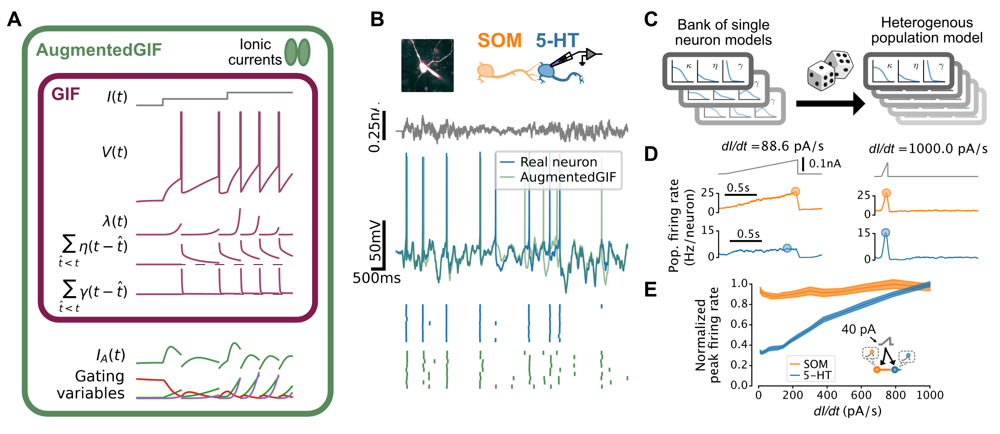

# RapheGIF

 

Code for building experimentally-contstrained spiking neural network models of
the dorsal raphe nucleus (DRN).

<figure>
    
    <figcaption>
        <b>A</b> Augmented generalized integrate-and-fire (aGIF) models add
        biophysical realism to GIF models. <b>B</b> aGIFs can be trained to
        imitate individual neurons.  <b>C</b> Resampling a bank of aGIFs
        yields a population model with realistic heterogeneity. <b>D</b>,
        <b>E</b> Simulated 5-HT populations encode the derivative of their
        input.
    </figcaption>
</figure>

For more information, see our [paper](https://www.biorxiv.org/content/10.1101/2021.06.25.449907):

> Emerson F. Harkin, Alexandre Payeur, Michael B. Lynn, Jean-François Boucher,
> Léa Caya-Bissonnette, Dominic Cyr, Chloe Stewart, André Longtin, Richard
> Naud, and Jean-Claude Béïque. Temporal derivative computation in the dorsal
> raphe network revealed by an experimentally-driven augmented
> integrate-and-fire modeling framework. bioRxiv, 2021. doi:
> 10.1101/2021.06.25.449907

## Overview

The project is broken up into `grr`, a reusable library for fitting GIF neuron
models forked from the excellent [GIF Fitting
Toolbox](https://github.com/pozzorin/GIFFittingToolbox), `analysis` scripts for
reproducing the models and simulations from [our
paper](https://www.biorxiv.org/content/10.1101/2021.06.25.449907), and
`figs/scripts` for reproducing the figures in our paper from the results of
`analysis`.

    .
    ├── analysis                        # Data analysis + simulation scripts
    │   ├── GIF_pipeline                # Fit spiking neuron models
    │   ├── GIFnet_pipeline             # Run network simulations
    │   │   └── input_generators
    │   ├── gaba_synapses
    │   └── gating                      # Characterize I_A in 5-HT neurons
    ├── figs
    │   └── scripts                     # Notebooks to reproduce figures
    └── grr                             # Library for fitting + running models

To use the augmented GIF model in your own work, clone or download this repo and
install `grr` using `pip install . && pip install -r requirements.txt` from
inside the project.

To reproduce the results from our paper, follow these steps:

1. Clone or download this repo and install `grr`.
2. Get a copy of the [raw data](https://doi.org/10.5061/dryad.66t1g1k2w) and
   extract it to a new directory called `data/raw`.
3. Run the scripts in `analysis`. `GIF_pipeline` must be run before
   `GIFnet_pipeline`.
4. Run the notebooks in `figs/scripts`. High resolution figures can be exported
   to `figs/ims`.

## Contributions

Christian Pozzorini wrote the [GIF Fitting
Toolbox](https://github.com/pozzorin/GIFFittingToolbox) that forms the
foundation of `grr`. All remaining code was written by [Emerson
Harkin](https://github.com/efharkin). [Alexandre
Payeur](https://github.com/apayeur) prototyped some of the models included in
`grr` and provided valuable input on all aspects of the project along with
[Richard Naud](http://www.neurodynamic.uottawa.ca/neuralcoding/index.html) and
[Michael Lynn](https://github.com/micllynn).

## License

Science thrives on openness. This work is released under the [MIT
license](LICENSE.txt) and is free to use for any purpose. If you find our work
useful, please cite our paper!

    @article{harkin_temporal_2021,
        title = {
            Temporal derivative computation in the dorsal raphe network
            revealed by an experimentally-driven augmented integrate-and-fire
            modeling framework
        },
        doi = {10.1101/2021.06.25.449907},
        journaltitle = {{bioRxiv}},
        author = {
            Harkin, Emerson F and Payeur, Alexandre and Lynn, Michael B
            and Boucher, Jean-François and Caya-Bissonnette, Léa
            and Cyr, Dominic and Stewart, Chloe and Longtin, André
            and Naud, Richard and Béïque, Jean-Claude
        },
        date = {2021},
        langid = {english},
    }
