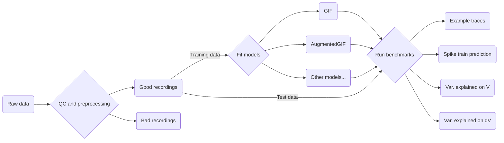
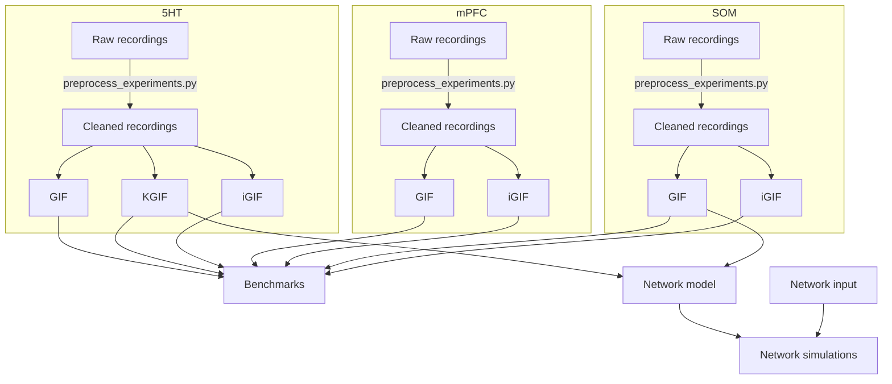

# Fitting single-cell models to DRN and mPFC neurons

## Pipeline for single cell models

The analysis pipeline ingests raw electrophysiological data in Axon Binary
Format, uses it to train single cell models from `grr`, and outputs various
benchmarks computed on held-out data. These three stages are implemented by the
`AEC_QC.py`, `fit_mods.py`, and `run_all_benchmarks.sh` scripts in this
directory. The scripts are designed to be run from the command line to process
experiments/models in batches. Running `make all` from this directory reproduces
my GIF-based models of DRN neurons and mPFC pyramidal cells along with their
associated benchmarks.

## Detailed pipeline

From single cells to networks.

