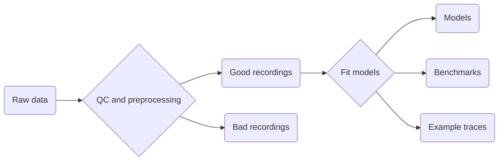
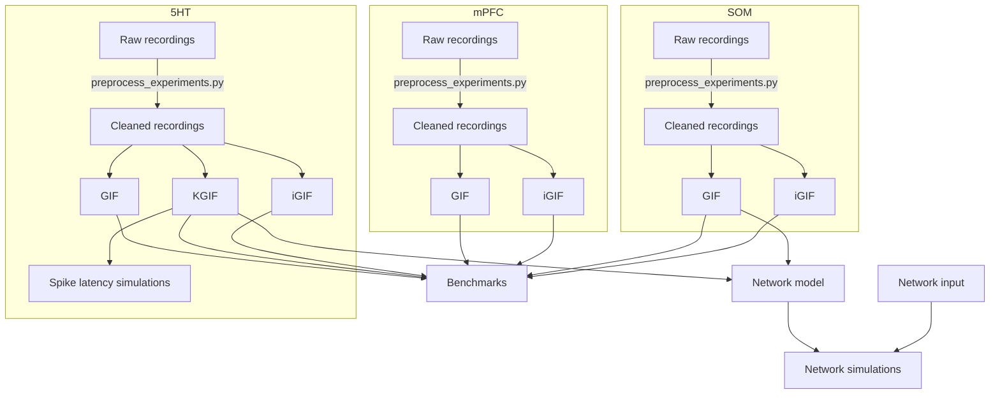

# GIF fitting pipeline

## Pipeline for single cell models

Goal is to take in raw recordings and output fitted models, benchmarks, and
example traces.

Notes:
- Quality control step should accept parameters for rejection thresholds.
- Each model probably needs its own fitting script.

## Detailed pipeline

From single cells to networks.

